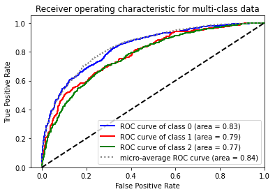

# Iliopoulos Nikolaos - 1115201800332

## AI 2 Exersice 3 - RNN with LSTM & GRU cells

## Table of Contents

1. [General Info (page 1)](#GeneralInfo)

2. [Models with Vanillia RNN](#section1)

   2.1. [First Model](#section1_1)

   2.2. [Hidden size from 32 to 256](#section1_2)

   2.3. [Hidden size from 256 to 1024](#section1_3)

   2.3. [Number of Layers 2](#section1_4)

   2.3. [Other Experiments](#section1_5)

3. [Experiment with GRU and LSTM Cells](#section2)

   3.1. [First Model GRU Cell](#section2_1)

   3.2. [Βidirectional = True](#section2_2)

   3.3. [Νumber of layers = 2](#section2_3)

   3.3. [AMSGrad = True](#section2_4)

   3.3. [First Model LSTM Cell](#section2_5)

   3.4. [Bidirectional = True, Νumber of Layers = 2, Dropout Propability = 0.2](#section2_6)

4. [Best Model](#section3)
5. [Conclusion | Compare of models](#section4)

---

### General Info 

I experimented with:

- Learning Rates: **0.00001**
- Batch Size: **64**
- Hidden Size: **32, 64, 128, 256**
- Stacked RNN: **1, 2**
- Dropout Propability: **0.1, 0.2, 0.3**
- RNN Cell Type: **Vanillia RNN, LSTM, GRU**
- GloVe: **50, 300**

For all the experiments i used glove embeddings & i preprocessed the data with the following steps:

- Remove Url
- Remove Punctuation
- Remove Emoticons
- Remove extra whitespaces
- Tokenize the text
- Lematize the text

---

### Models with Vanillia RNN 

#### First Model 

- GloVe embedding with the 300 dimensions file.(i choosed the 300d vs the othes cause more feautures means more information)
- For every word in the sentence, i summed it to an 1x300 array.
- learning rate=0.00001
- Hidden size = 32
- Number of Layers = 1
- Droupout Propability = 0

    
    
    

For a first model the results are not so bad. There model is not overfitting or underfitting. **It just need a little help to learn better**. We can see that the loss is deacreasing but it is not low enough. F1 score is not very good.

**I will increase the hidden size from 32 to 256** and hopefully these is an improvement in the loss and F1 score.

---

#### Hidden size from 32 to 256 

    
    
    

**As excpected the loss is slightly lower and the F1 score is increased by 0.1.**
But we can see that there is a very small gap between the loss of the train and the loss of the validation sets. **This is happening cause vanillia RNN has short-term memory problem.**

---

#### Hidden size from 256 to 1024 

    
    
    

Now it is clear that from quadruplicating the hidden size we did not get any improvement in the loss and F1 score.
But we managed to **increase the overfit of the model**.
Of course i will **keep the hidden size to 256**.
I want to see how much the results are affected by **increasing the number of layers to 2.**

---

#### Number of Layers 2 

    
    
    

The results where almost the same as the previous model with 256 hidden size and 1 layer.
In the current model **without LSTM or GRU cells the second layer is not helping at all.**

**Short-term memory is the main reason why the results are not so good.**

---

#### Other Experiments 

I tried several **dropout propabilities (0.1, 0.2, 0.3**) and i found that the results did not change that much. I also tried setting the **bidirectional to True** and **other glove sizes**, but it did not help either.
The problem of the short-term memory can only be fixed by the use of **LSTM** or **GRU** cells.

---

### Experiment with GRU and LSTM Cells 

I saw that the results from the vanillia RNN model **suffered** from the short-term memory problem. So i will try with GRU and LSTM cells.
**Hopefully this will help to overcome the short-term memory problem and improve the loss and F1 score without overfitting.**

#### First Model GRU Cell 

I will begin with:

- Hidden size = **256**
- Number of Layers = **1**
- Droupout Propability = **0**
- Bidirectional = **False**

    
    
    

The improvements was minor in the loss and F1 score.
I will try with **bidirectional = True**.

---

#### Βidirectional = True 

By using bidirectional the model takes the last hidden state of the forward and backward RNN. This helps the model to learn better.

    
    
    

We can see that the loss is slightly lower. Thats a good sign. Lets see if we can improve the F1 score **by increasing the number of layers to 2**.

---

#### Νumber of layers = 2 

    
    
    

Unfortunately **the model overfitted** but the f1 score improved.
Maybe with amsgrad = True in the Adam optimizer we can try to reduce the overfitting.

---

#### AMSGrad = True 

    
    
    

**The results did not improve. I will try to change GRU to LSTM.**

---

#### First Model LSTM Cell 

Started with:

- Number of Layers 1
- Hidden Size 256
- Glove 300d
- amsgrad=True

LSTM Cells are able to predict sequential data and should remember longer sequences than GRU Cells.

    
    
    

**The overfit has been reduced** and the F1 score improved. The changes are minor but still i could say that LSTM performed better than GRU.

---

#### Bidirectional = True, Νumber of Layers = 2, Dropout Propability = 0.2

    
    
    

We can see that there is a little bit more overfit, cause the model is too compilicated. **The results are the same as the previous model's basically.**

> I would say that the **simple LSTM model** is not great but its the best among the other experiments.

---

### Best Model 

- LSTM Cells
- Number of Layers 1
- Hidden Size 256
- Glove 300d
- amsgrad=True

    
    
    

---

### Conclusion | Compare of models 

I would say that RNN models **are harder to train** than FeedForward Neural Network.
I saw that the best model from the exercise 2 the model had **0.15 loss** and **0.61 F1 score**.
The best RNN model has **0.75 loss (way higher)** but the **F1 score managed to be better 0.65**.
That tells me the power of RNN Networks. Even if the loss is high the model can still scores high.
